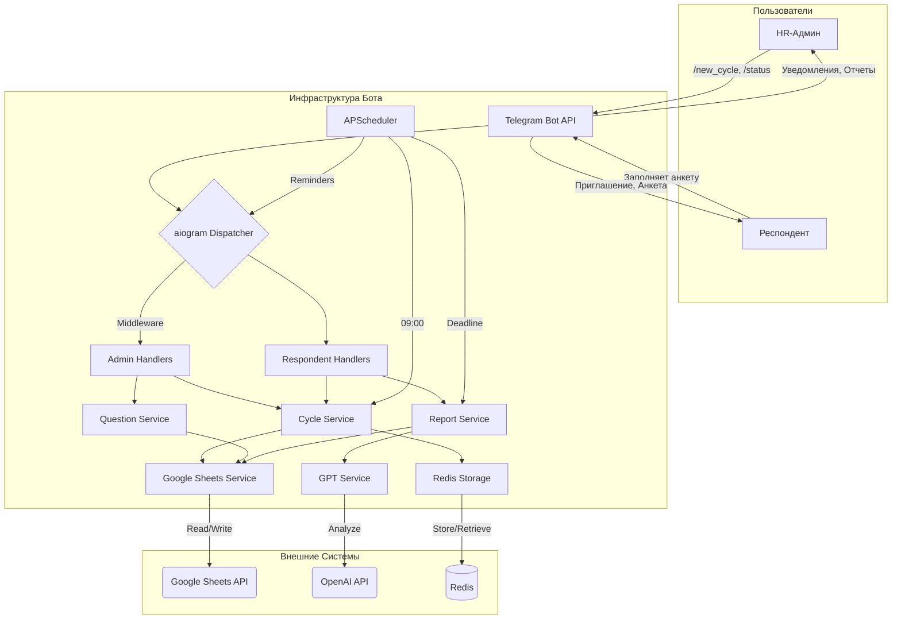

# План проектирования: Telegram-бот для 360-градусного фидбэка (Версия 2.0)

## 1. Executive Summary & Goals
Основная цель этого документа — предоставить комплексный архитектурный план для разработки Telegram-бота, автоматизирующего процесс сбора 360-градусной обратной связи. План основан на предоставленном техническом задании (`ТЗ`) и **обновлен с учетом уточнений от 2024-05-23**.

**Ключевые цели:**
1.  **Определить технологический стек и архитектуру**, обеспечивающие надежность, масштабируемость и простоту поддержки, включая динамическую загрузку анкет.
2.  **Декомпозировать разработку на управляемые фазы и задачи**, создав четкую дорожную карту для команды.
3.  **Зафиксировать принятые решения** по ранее открытым вопросам, сделав требования более конкретными и выполнимыми.

## 2. Current Situation Analysis
Проект находится на стадии детализации требований. Исходным артефактом является `ТЗ` и ряд уточнений, которые конкретизируют следующие аспекты:
*   **Авторизация HR:** Статический список Telegram ID в конфигурации.
*   **Создание цикла:** Пошаговый ввод респондентов для удобства HR.
*   **Анкета:** Вопросы загружаются динамически из специального листа Google Sheets.
*   **Генерация отчета:** GPT используется для суммаризации всех ответов на открытые вопросы "Сильные стороны" и "Точки роста".
*   **Обработка ошибок:** Для API Google и OpenAI определены стратегии повторных запросов и fallback-механизмы.
*   **Синхронизация данных:** Справочник сотрудников обновляется по требованию при запуске нового цикла.

## 3. Proposed Solution / Refactoring Strategy
### 3.1. High-Level Design / Architectural Overview
Предлагается сервис-ориентированная архитектура на Python с использованием асинхронного фреймворка `aiogram`.

*   **Бот (Application Core):** Принимает и обрабатывает запросы от пользователей. Использует `aiogram` FSM для управления диалогами. Защищен мидлварью для разграничения доступа.
*   **Сервисный слой (Services):** Инкапсулирует бизнес-логику. Включает сервисы для управления циклами, работы с Google Sheets, генерации отчетов, загрузки анкет и т.д.
*   **Хранилище состояний (State Storage):** `Redis` для хранения оперативных данных: активные циклы, черновики анкет, токены респондентов.
*   **Хранилище данных (Data Storage):** `Google Sheets` используется как основная база данных для справочника сотрудников, списка вопросов и записи всех собранных ответов.
*   **Планировщик (Scheduler):** `APScheduler` запускает регулярные задачи: напоминания, ежедневные сводки и генерацию финального отчета.

**Диаграмма взаимодействия компонентов:**


### 3.2. Key Components / Modules
Структура проекта остается прежней, но с добавлением нового сервиса для работы с вопросами.

| Директория/Модуль | Описание |
|---|---|
| `backend/src/bot/handlers/` | Обработчики Telegram, разделенные по ролям (admin, respondent). |
| `backend/src/bot/middlewares/` | Мидлварь для проверки прав HR-администратора. |
| `backend/src/services/` | Ядро бизнес-логики. |
| `services/employee_service.py` | Логика получения данных о сотрудниках из Google Sheets по запросу. |
| `services/question_service.py` | **(Новый)** Логика загрузки и кэширования вопросов анкеты из Google Sheets. |
| `services/cycle_service.py` | Управление жизненным циклом опросов. |
| `services/report_service.py` | Генерация сводок и отчетов, включая взаимодействие с GPT. |
| `services/google_sheets.py` | Низкоуровневая обертка для работы с Google Sheets API. |
| `backend/src/storage/` | Модули для работы с Redis. |
| `backend/src/config.py` | Конфигурация приложения, включая список ID администраторов. |
| `infra/` | Файлы для развертывания (Dockerfile, docker-compose.yml). |

### 3.3. Detailed Action Plan / Phases

#### Phase 1: Foundation & Core Services
*   **Objective(s):** Настроить окружение, создать базовую структуру проекта и реализовать сервисы для работы с внешними API.
*   **Priority:** High

*   **Task 1.1: Project Setup**
    *   **Deliverable/Criteria for Completion:** Инициализирован репозиторий, настроен `poetry`, создана структура директорий, базовый `Dockerfile` и `docker-compose.yml`.
*   **Task 1.2: Configuration Management**
    *   **Deliverable/Criteria for Completion:** Реализован `config.py` (`pydantic-settings`), который загружает токены и **статический список `ADMIN_TELEGRAM_IDS`** из `.env` файла.
*   **Task 1.3: Google Sheets Service Implementation**
    *   **Deliverable/Criteria for Completion:** Создан `google_sheets.py`. **Реализованы retry-механизмы (например, с библиотекой `tenacity`) для всех вызовов API.** Функции для чтения сотрудников, **чтения вопросов**, создания листа и добавления строк.
*   **Task 1.4: Redis Storage Implementation**
    *   **Deliverable/Criteria for Completion:** Реализован `redis_storage.py` для сохранения/загрузки Pydantic-моделей.

#### Phase 2: HR-Admin Functionality
*   **Objective(s):** Реализовать полный функционал для роли HR-администратора с учетом новых требований.
*   **Priority:** High

*   **Task 2.1: Dynamic Questionnaire Service**
    *   **Rationale/Goal:** Обеспечить возможность изменять анкету без передеплоя бота.
    *   **Estimated Effort:** M
    *   **Deliverable/Criteria for Completion:** Реализован `question_service.py`, который читает вопросы из листа `Questions` в Google Sheets и кэширует их в Redis.
*   **Task 2.2: Employee Data Service**
    *   **Rationale/Goal:** Обеспечить доступ к актуальным данным сотрудников.
    *   **Estimated Effort:** S
    *   **Deliverable/Criteria for Completion:** Реализован `employee_service.py`. **Данные о сотрудниках загружаются из Google Sheets каждый раз при запуске команды `/new_cycle`**.
*   **Task 2.3: Implement `/new_cycle` command with Step-by-Step FSM**
    *   **Rationale/Goal:** Создать удобный и надежный процесс запуска циклов.
    *   **Estimated Effort:** L
    *   **Deliverable/Criteria for Completion:** Реализован FSM для `/new_cycle`. Бот запрашивает Target ID, затем **пошагово предлагает вводить Respondent ID** (с автодополнением по ФИО) и предоставляет кнопку "Завершить ввод". После этого запрашивается Deadline.
*   **Task 2.4: Implement `/cancel` and `/status` commands**
    *   **Estimated Effort:** M
    *   **Deliverable/Criteria for Completion:** Реализованы команды `/cancel <Cycle_ID>` и `/status`.
*   **Task 2.5: Admin Authorization Middleware**
    *   **Rationale/Goal:** Защитить административные команды от несанкционированного доступа.
    *   **Estimated Effort:** S
    *   **Deliverable/Criteria for Completion:** Создана мидлварь для `aiogram`, которая проверяет `telegram_id` пользователя по списку `ADMIN_TELEGRAM_IDS` из конфига.

#### Phase 3: Respondent Flow & Data Collection
*   **Objective(s):** Реализовать динамический процесс заполнения анкеты для респондентов.
*   **Priority:** High

*   **Task 3.1: Start Token Handling**
    *   **Deliverable/Criteria for Completion:** При создании цикла генерируются уникальные токены (например, `uuid4`). В Redis создается маппинг `token -> {cycle_id, respondent_id}`. Бот корректно обрабатывает `/start <token>`.
*   **Task 3.2: Dynamic Questionnaire FSM**
    *   **Rationale/Goal:** Адаптировать процесс анкетирования под вопросы из Google Sheets.
    *   **Estimated Effort:** L
    *   **Deliverable/Criteria for Completion:** Реализован FSM для анкеты. Бот **получает список вопросов из `question_service`** и динамически генерирует шаги диалога. Ответы сохраняются в черновик в Redis.
*   **Task 3.3: Submission Logic**
    *   **Deliverable/Criteria for Completion:** После нажатия "Отправить" данные записываются в Google Sheet. **В случае ошибки записи, бот уведомляет респондента и HR-админа о проблеме.**

#### Phase 4: Automation & Reporting
*   **Objective(s):** Реализовать автоматические уведомления и генерацию отчетов с GPT-суммаризацией.
*   **Priority:** Medium

*   **Task 4.1: Scheduler Setup**
    *   **Deliverable/Criteria for Completion:** `APScheduler` интегрирован в приложение.
*   **Task 4.2: Implement Reminders & Daily Summary**
    *   **Deliverable/Criteria for Completion:** Реализованы и добавлены в планировщик задачи для отправки напоминаний и ежедневной сводки.
*   **Task 4.3: Final Report Generation & GPT Integration**
    *   **Rationale/Goal:** Автоматизировать создание итогового отчета с качественным анализом.
    *   **Estimated Effort:** M
    *   **Deliverable/Criteria for Completion:**
        1.  Разработан `report_service`.
        2.  Рассчитываются средние оценки, формируется CSV-ссылка.
        3.  **Все ответы на вопрос "Сильные стороны" агрегируются и отправляются в GPT для получения саммари. Аналогично для "Точек роста".**
        4.  **Разработан и протестирован промпт для GPT.**
        5.  **В случае сбоя GPT API, отчет генерируется без саммари, но с соответствующим предупреждением для HR-админа.**

### 3.4. Data Model Changes
Добавляются модели для вопросов.

```python
# file: backend/src/storage/models.py

from pydantic import BaseModel, Field
from typing import List, Optional, Dict, Literal

class Question(BaseModel):
    id: str  # e.g., "q1", "strengths"
    text: str
    type: Literal["scale", "text"]

class FeedbackDraft(BaseModel):
    cycle_id: str
    respondent_id: str
    # Ключ - ID вопроса, значение - ответ
    answers: Dict[str, int | str] = {}

# Остальные модели (Employee, FeedbackCycle) остаются без изменений.
```

## 4. Key Considerations & Risk Mitigation
### 4.1. Technical Risks & Challenges
| Риск | Вероятность/Влияние | Стратегия митигации |
|---|---|---|
| **Недоступность/ошибки Google Sheets API** | Medium/High | **Реализовать 2-3 попытки повторного запроса с экспоненциальной задержкой. В случае окончательной неудачи (например, при записи ответа или создании цикла), уведомить HR-администратора в Telegram о проблеме и залогировать ее.** |
| **Недоступность/ошибки OpenAI API** | Medium/Medium | **Реализован fallback-механизм: если GPT API недоступно, генерировать отчет без саммари по открытым вопросам. В текст отчета добавить явное предупреждение для HR-админа: "Автоматический анализ текста не удался. Данные доступны в CSV-файле."** |
| **Безопасность: неавторизованный доступ к HR-командам** | Low/High | **Реализовать мидлварь, которая сверяет Telegram ID пользователя со статическим списком администраторов в файле конфигурации. Доступ к хендлерам HR-команд будет разрешен только для ID из этого списка.** |
| **Некорректный формат данных в листах `Employees` или `Questions`** | Medium/Medium | Реализовать строгую валидацию данных при чтении с помощью Pydantic. В случае ошибки парсинга строки, логировать ее и пропускать, продолжая обработку остальных. При запуске `/new_cycle` выводить HR-админу предупреждение, если были обнаружены некорректные записи. |

## 5. Success Metrics / Validation Criteria
*   **Количественные:**
    *   Время от идеи до получения отчета для HR-админа сократилось на 90%.
    *   Количество успешно завершенных циклов в месяц.
    *   Uptime сервиса > 99.5%.
*   **Качественные:**
    *   HR-администраторы могут самостоятельно и без ошибок запускать и управлять циклами.
    *   **HR-администраторы могут изменять анкету через Google Sheets без привлечения разработчиков.**
    *   Итоговые отчеты, включая GPT-саммари, признаны информативными.

## 6. Assumptions Made
*   Справочник сотрудников (`Employees`) и анкета (`Questions`) в Google Sheets поддерживаются в актуальном состоянии и в корректном формате.
*   Компания готова предоставить и оплачивать доступ к OpenAI API.
*   Все пользователи бота имеют аккаунты в Telegram.
*   Для листа `Questions` будет согласован и задокументирован строгий формат колонок (например, `question_id`, `question_text`, `question_type`).